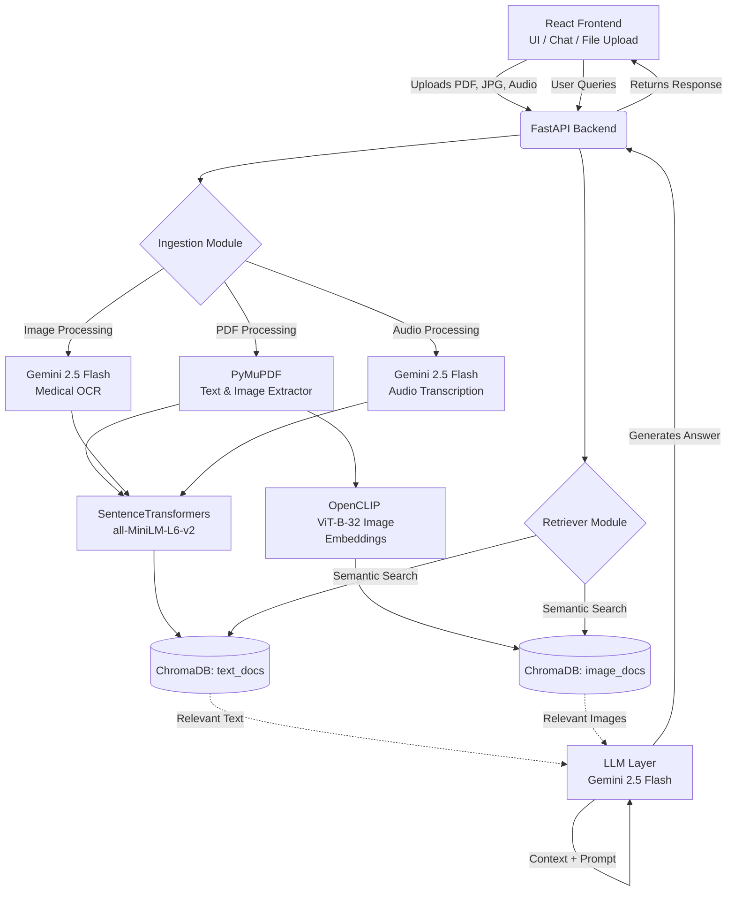

# HealthRAG: Advanced Multi-Modal Medical Q&A System

## Overview
HealthRAG is a state-of-the-art End-to-End Multi-Modal Medical Document Question & Answering System. The platform empowers patients and medical professionals to securely upload complex medical documents (PDF reports), medical imaging (X-rays, scans in JPG/PNG), and audio recordings (doctor consultations in MP3/WAV). Utilizing advanced Retrieval-Augmented Generation (RAG), it delivers easy-to-understand, plain-English explanations directly from the uploaded context.

## Table of Contents
- [System Architecture](#system-architecture)
- [Unique Selling Proposition (USP)](#unique-selling-proposition-usp)
- [Characteristics & Qualities](#characteristics--qualities)
- [How is it Different & Useful?](#how-is-it-different--useful)
- [Challenges Faced](#challenges-faced)
- [Literature Survey](#literature-survey)
- [Team Contributions](#team-contributions)
- [Future Scope](#future-scope)
- [Running the Project](#running-the-project)

---

## System Architecture

The architecture uses a decoupled React frontend and FastAPI backend, heavily leveraging a persistent ChromaDB vector store and Google's Gemini 2.5 Flash model for multi-modal generation and OCR/Transcription.



### Technical Flow
1. **Frontend:** React + Vite UI allows users to upload documents, images, and audio files.
2. **Backend Ingestion:** 
   - **PDFs:** PyMuPDF parses textual data and extracts embedded images.
   - **Images:** Gemini 2.5 Flash performs high-accuracy OCR to extract handwritten prescriptions or printed text.
   - **Audio:** Gemini 2.5 Flash directly transcribes medical consultations or voice notes.
3. **Embedding & Storage:** Text and transcripts are embedded using `all-MiniLM-L6-v2`. Images are embedded using `OpenCLIP ViT-B-32`. Both are stored in persistent ChromaDB collections.
4. **Retrieval & Generation:** User queries are semantically matched against text and images. The most relevant text chunks and raw physical image files are injected into the context of Gemini 2.5 Flash, which formulates an answer strictly adhering to the medical context.

---

## Unique Selling Proposition (USP)
HealthRAG's USP is its **Tri-Modal Intelligence and Advanced Context Injection**. While standard RAG systems index text, our platform seamlessly synthesizes physical images, audio transcriptions, and raw text into a single queryable semantic space. Furthermore, we don't just use image embeddings for search; the system natively passes retrieved physical images back to the vision-language model (Gemini 2.5 Flash) during answer generation, ensuring maximum visual fidelity for medical queries.

---

## Characteristics & Qualities
* **Omni-Format Support:** Handles PDFs, explicit image uploads (JPG/PNG), and audio files (MP3/WAV/M4A).
* **AI-Powered OCR & Transcription:** Eliminates the need for traditional, error-prone OCR engines by using cutting-edge LLMs for extraction.
* **Strict Context Grounding:** The prompt architecture heavily restricts the model from relying on external training data, virtually eliminating medical hallucination.
* **Built-in Safety Rails:** Hardcoded medical disclaimers and refusal mechanisms ensure users seek professional help for critical care.
* **Stateful Persistence:** Uses ChromaDB's persistent client, allowing users to build a continuous health knowledge base over time.

---

## How is it Different & Useful?
* **How it's Different:** Most consumer AI models lose visual context from PDFs or fail to cross-reference a doctor's audio note with an X-ray. HealthRAG embeds and correlates all these formats together. 
* **How it's Useful:** 
  - **For Patients:** It decodes dense lab reports, transcribes confusing doctor consultations, and explains medical jargon.
  - **For Professionals:** It acts as a rapid research assistant, allowing doctors to search through a patient's historical scans and notes in seconds.

---

## Challenges Faced
1. **Handling Heavy ML Models:** Integrating `SentenceTransformers` and `OpenCLIP` within a FastAPI backend caused memory bottlenecks. We solved this by pre-loading models on the FastAPI `@app.on_event("startup")` hook to prevent latency on individual requests.
2. **Multi-Modal Synchronization:** Extracting images gracefully from PDFs using PyMuPDF and ensuring they mapped correctly to the same semantic space as the text.
3. **Gemini Storage Management:** Implementing audio transcription required uploading files to Gemini's remote storage. We had to implement robust `try/except` blocks to manually delete these files post-transcription to maintain privacy and prevent storage leaks.
4. **Cross-Collection Search:** Querying two separate ChromaDB collections (`text_docs` and `image_docs`) and fusing the results gracefully for the final LLM prompt.

---

## Literature Survey
**Paper:** *Medprompt: Generative AI as a Medical Agent* (Microsoft Research)

**Key Insights & Implementation:**
1. The paper investigates how foundation models require specialized agentic workflows (like dynamic few-shot selection and explicit reasoning paths) to achieve expert-level performance on clinical benchmarks, rather than relying on zero-shot generation.
2. **Application in our Project:** We adopted Medprompt's core philosophy by restricting the LLM's memory. We built a rigorous prompt wrapper (`llm.py`) that forces Gemini 2.5 Flash to act solely as a synthesizer of the retrieved ChromaDB context rather than an independent oracle.
3. The paper's emphasis on mitigating hallucinations directly inspired our strict safety guidelines, ensuring the model states "cannot find the answer" if the context is missing, alongside a mandatory medical disclaimer.

---

## Team Contributions

**Student 1 (Backend, AI Architecture & Data Ingestion):**
* Designed the FastAPI backend architecture (`main.py`).
* Engineered the advanced ingestion pipeline (`ingestion.py`), integrating PyMuPDF for PDFs, and Gemini 2.5 Flash for Image OCR and Audio Transcription.
* Set up the dual-collection `ChromaDB` vector store (`retriever.py`) and configured `SentenceTransformers` and `OpenCLIP` for embeddings.
* Wrote the strict generation prompt for the LLM layer (`llm.py`).

**Student 2 (Frontend, UI/UX & DevOps):**
* Developed the interactive React (Vite) frontend with a responsive, modern aesthetic.
* Implemented multi-format `FormData` uploading (handling documents, images, and audio).
* Built the chat interface, integrated `react-markdown` for rich text rendering, and implemented the database wipe functionality.
* Containerized the entire application, writing `Dockerfile`s for both services and the `docker-compose.yml` orchestrator.

---

## Future Scope
* **DICOM Integration:** Expanding the image processor to handle native medical imaging formats (DICOM) used in MRI and CT scans.
* **EHR Interoperability:** Connecting to Electronic Health Record systems via FHIR APIs for automated patient history ingestion.
* **Multi-Agent Diagnostics:** Introducing specialized sub-agents (e.g., a "Radiology Agent" vs. a "Pathology Agent") that debate findings before presenting a unified answer to the user.
* **Federated Learning:** Implementing localized privacy-preserving model updates directly on hospital servers without transmitting raw patient data.

---

## Running the Project

### Prerequisites
* Node.js, Python 3.11, Docker Desktop, Git

### Local Setup
1. Clone the repository and navigate to the project directory:
   ```bash
   git clone <repo-url>
   cd medical_rag_project
   ```
2. Add your Gemini API Key:
   * Create a `.env` file in the root directory.
   * Add: `GEMINI_API_KEY=your_api_key_here`
3. Run with Docker Compose:
   ```bash
   docker-compose up --build
   ```
4. Access the frontend interface at `http://localhost:5173`.