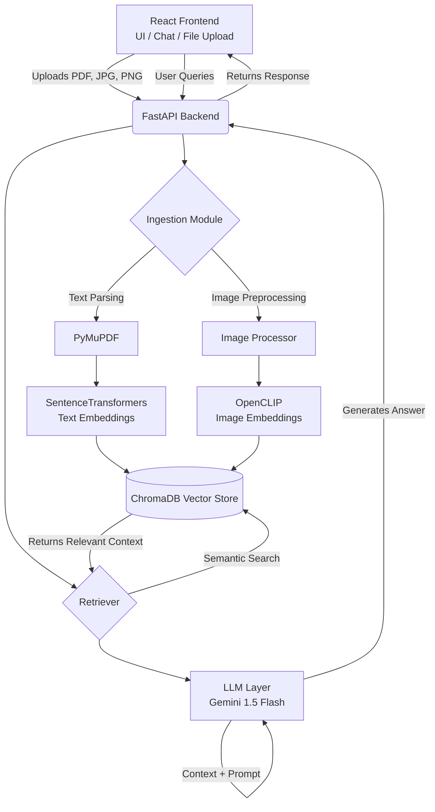

# HealthRAG: Multi-Modal Medical Document Q&A System

## Overview
HealthRAG is an End-to-End Multi-Modal Medical Document Question & Answering System. The project allows patients and medical professionals to upload complex medical documents (such as clinical reports in PDF format and medical imaging like X-rays in JPG/PNG format) and receive easy-to-understand, plain-English explanations using advanced Retrieval-Augmented Generation (RAG).

## Table of Contents
- [System Architecture](#system-architecture)
- [Unique Selling Proposition (USP)](#unique-selling-proposition-usp)
- [Characteristics & Qualities](#characteristics--qualities)
- [How is it Different & Useful?](#how-is-it-different--useful)
- [Challenges Faced](#challenges-faced)
- [Literature Survey](#literature-survey)
- [Team Contributions](#team-contributions)
- [Future Scope](#future-scope)
- [Running the Project](#running-the-project)

---

## System Architecture

The architecture relies on a decoupled React frontend and FastAPI backend, using a vector database for context retrieval and a Large Language Model (LLM) for natural language understanding.



### Textual Flow
1. **Frontend:** User uploads a file and asks a medical question.
2. **Backend (Ingestion):** PyMuPDF extracts text/images from PDFs. SentenceTransformers embed text, and OpenCLIP embeds images.
3. **Database:** ChromaDB stores these multi-modal embeddings.
4. **Backend (Retrieval):** The system converts the user's query into embeddings and retrieves the most relevant text/images from ChromaDB.
5. **Generation:** Google Gemini uses the retrieved medical context to answer the user's query accurately, appending a professional medical disclaimer.

---

## Unique Selling Proposition (USP)
The primary USP of HealthRAG is its **True Multi-Modal Medical Understanding**. Unlike standard RAG systems that only process text, HealthRAG natively understands both clinical text (blood reports, prescriptions) and medical imagery (X-rays, scans) simultaneously, bringing them into a unified semantic space for querying.

---

## Characteristics & Qualities
* **Multi-Modal Native:** Uses OpenCLIP and SentenceTransformers to fuse text and vision seamlessly.
* **Highly Accurate:** Grounds answers strictly in the uploaded medical context to prevent LLM hallucination.
* **Privacy-Conscious:** Documents are processed securely and temporarily in the vector store.
* **User-Centric UI:** Premium, glassmorphic design that reduces anxiety often associated with medical software.
* **Safety First:** Hardcoded medical disclaimers ensure users consult human doctors for critical care.

---

## How is it Different & Useful?
* **How it's Different:** Most existing consumer LLMs (like ChatGPT or basic RAG apps) lose the visual context of a PDF (e.g., charts, embedded scans) or cannot properly cross-reference a text report with a separate X-ray. HealthRAG solves this by embedding both modalities into ChromaDB.
* **How it's Useful:** It empowers patients to understand dense medical jargon in their lab results and gives preliminary insights into their medical scans before their doctor's appointment, reducing patient anxiety and improving health literacy.

---

## Challenges Faced
1. **Multi-Modal Synchronization:** Extracting embedded images correctly from PDFs using PyMuPDF and aligning them with the surrounding text context.
2. **Resource Management:** Managing memory limits when loading the heavy OpenCLIP vision model inside a Docker container.
3. **Vector Dimension Mismatches:** Ensuring text embeddings and image embeddings mapped cleanly for seamless semantic search in ChromaDB.
4. **Hallucination Mitigation:** Tuning the system prompts to strictly answer *only* from the provided documents and to refuse answering if the context lacks the medical information.

---

## Literature Survey
**Paper:** *Medprompt: Generative AI as a Medical Agent* (Microsoft Research)

**Key Learnings & Implementation:**
1. The paper explores how foundation models can be prompted using advanced agentic workflows to achieve expert-level performance on medical benchmarks.
2. It highlights that instead of relying purely on zero-shot generation, dynamic few-shot selection and chain-of-thought drastically improve clinical accuracy.
3. **Application in our project:** We incorporated the core philosophy of this paper by grounding our LLM strictly in retrieved context (RAG) rather than its internal memory. 
4. The paper highlights the danger of LLM hallucinations in medicine, which inspired our strict requirement to append a professional medical disclaimer to all outputs and tune the prompt to refuse unsupported claims.
5. Overall, the research validates that domain-specific RAG systems outperform generalized chat models in clinical accuracy.

---

## Team Contributions

**Student 1 (Backend & AI Architecture):**
* Developed the FastAPI web server.
* Integrated `PyMuPDF` for PDF parsing and image extraction.
* Configured `ChromaDB` and built the embedding pipeline using `sentence-transformers` and `OpenCLIP`.
* Integrated Google Gemini 1.5 API to generate accurate, context-aware answers.

**Student 2 (Frontend & DevOps):**
* Built the responsive React (Vite) interface with a modern Glassmorphism aesthetic.
* Implemented complex file uploading logic (FormData handling PDFs and Images) and the chat UI.
* Wrote the Dockerfiles for both services and orchestrated them using `docker-compose.yml`.
* Ensured the system was easily deployable and containerized.

---

## Future Scope
* **DICOM File Support:** Integrating specialized medical image formats (DICOM) used in MRI and CT scans.
* **EHR Integration:** Connecting the system with Electronic Health Record (EHR) APIs like FHIR to fetch patient history automatically.
* **Agentic Workflows:** Adding multi-agent workflows where one AI analyzes the text, another the image, and a "Chief Physician" AI agent synthesizes the final diagnosis.
* **Voice Interface:** Adding Speech-to-Text and Text-to-Speech for visually impaired patients or elderly users.

---

## Running the Project

### Prerequisites
* Node.js, Python 3.11, Docker Desktop, Git

### Local Setup
1. Clone the repository and navigate to the project directory:
   ```bash
   git clone <repo-url>
   cd medical_rag_project
   ```
2. Add your Gemini API Key:
   * Create a `.env` file in the root directory.
   * Add: `GEMINI_API_KEY=your_api_key_here`
3. Run with Docker Compose:
   ```bash
   docker-compose up --build
   ```
4. Access the application at `http://localhost:5173`.